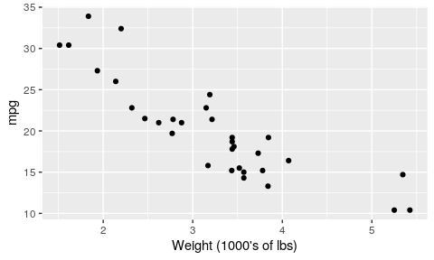
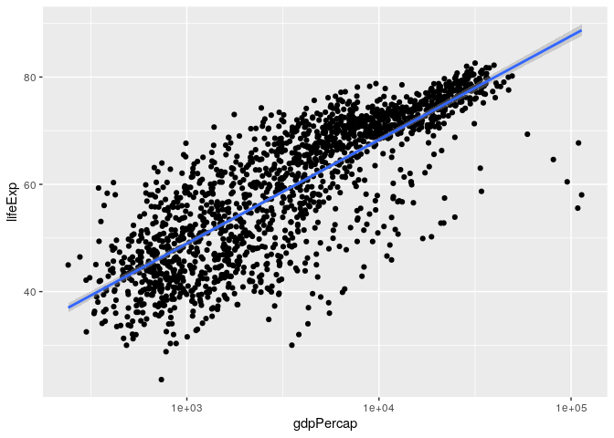

cm014 Worksheet: The Model-Fitting Paradigm in R
================

``` r
suppressPackageStartupMessages(library(tidyverse))
library(gapminder)
library(broom)
```

So you want to fit a model to your data. How can you achieve this with
R?

Topics:

1.  What *is* model-fitting?
2.  How do we fit a model in R?
3.  How can we obtain tidy results from the model output?

## What is Model-Fitting?

When variables are not independent, then we can gain information about
one variable if we know something about the other.

Examples: Use the scatterplot below:

1.  A car weighs 4000 lbs. What can we say about its mpg?
2.  A car weights less than 3000 lbs. What can we say about its mpg?

<!-- end list -->

``` r
library(tidyverse)
ggplot(mtcars, aes(wt, mpg)) +
  geom_point() +
  labs(x = "Weight (1000's of lbs)")
```

<!-- -->

Example: What can we say about rear axle ratio if we know something
about quarter mile time?

``` r
ggplot(mtcars, aes(qsec, drat)) + 
  geom_point() +
  labs(x = "Quarter mile time",
       y = "Rear axle ratio")
```

<!-- -->

If EDA isn’t enough, we can answer these questions by fitting a model: a
curve that predicts Y given X. Aka, a **regression curve** or a
**machine learning model**.

(There are more comprehensive models too, such as modelling entire
distributions, but that’s not what we’re doing here)

There are typically two goals of fitting a model:

1.  Make predictions.
2.  Interpret variable relationships.

## Fitting a model in R

Model fitting methods tend to use a common format in R:

    method(formula, data, options)

They also tend to have a common output: a special *list*.

**Method**:

A function such as:

  - Linear Regression: `lm`
  - Generalized Linear Regression: `glm`
  - Local regression: `loess`
  - Quantile regression: `quantreg::rq`
  - …

**Formula**:

In R, takes the form `y ~ x1 + x2 + ... + xp` (use column names in your
data frame).

**Data**: The data frame.

**Options**: Specific to the method.

Exercise:

1.  Fit a linear regression model to life expectancy (“Y”) from year
    (“X”) by filling in the formula. Notice what appears as the
    output.
2.  On a new line, use the `unclass` function to uncover the object’s
    true nature: a list. Note: it might be easier to use the `names`
    function to see what components are included in the list.

First, create a subset of the `gapminder` dataset containing only the
country of \`France

``` r
gapminder_France <- gapminder %>% filter(country == 'France')
```

Now, using the `lm()` function we will create the linear model

``` r
(my_lm <- lm(lifeExp ~ year, data = gapminder_France))
```

    ## 
    ## Call:
    ## lm(formula = lifeExp ~ year, data = gapminder_France)
    ## 
    ## Coefficients:
    ## (Intercept)         year  
    ##   -397.7646       0.2385

``` r
summary(my_lm)
```

    ## 
    ## Call:
    ## lm(formula = lifeExp ~ year, data = gapminder_France)
    ## 
    ## Residuals:
    ##      Min       1Q   Median       3Q      Max 
    ## -0.38013 -0.13894  0.01235  0.14295  0.33486 
    ## 
    ## Coefficients:
    ##               Estimate Std. Error t value Pr(>|t|)    
    ## (Intercept) -397.76460    7.28533  -54.60 1.03e-13 ***
    ## year           0.23850    0.00368   64.81 1.86e-14 ***
    ## ---
    ## Signif. codes:  0 '***' 0.001 '**' 0.01 '*' 0.05 '.' 0.1 ' ' 1
    ## 
    ## Residual standard error: 0.22 on 10 degrees of freedom
    ## Multiple R-squared:  0.9976, Adjusted R-squared:  0.9974 
    ## F-statistic:  4200 on 1 and 10 DF,  p-value: 1.863e-14

Does that mean that the life expectency at “year 0” was equal to
-397.7646?\! We are interested in the modeling results around the
modeling period which starts at year 1952. To get a meaniningful
“interpretable” intercept we can use the `I()` function.

``` r
(my_lm <- lm(lifeExp ~ I(year - 1952), data = gapminder_France))
```

    ## 
    ## Call:
    ## lm(formula = lifeExp ~ I(year - 1952), data = gapminder_France)
    ## 
    ## Coefficients:
    ##    (Intercept)  I(year - 1952)  
    ##        67.7901          0.2385

``` r
summary(my_lm)
```

    ## 
    ## Call:
    ## lm(formula = lifeExp ~ I(year - 1952), data = gapminder_France)
    ## 
    ## Residuals:
    ##      Min       1Q   Median       3Q      Max 
    ## -0.38013 -0.13894  0.01235  0.14295  0.33486 
    ## 
    ## Coefficients:
    ##                Estimate Std. Error t value Pr(>|t|)    
    ## (Intercept)    67.79013    0.11949  567.33  < 2e-16 ***
    ## I(year - 1952)  0.23850    0.00368   64.81 1.86e-14 ***
    ## ---
    ## Signif. codes:  0 '***' 0.001 '**' 0.01 '*' 0.05 '.' 0.1 ' ' 1
    ## 
    ## Residual standard error: 0.22 on 10 degrees of freedom
    ## Multiple R-squared:  0.9976, Adjusted R-squared:  0.9974 
    ## F-statistic:  4200 on 1 and 10 DF,  p-value: 1.863e-14

Use the `unclass()` function to take a look at how the `lm()` object
actually looks like.

``` r
unclass(my_lm)
```

    ## $coefficients
    ##    (Intercept) I(year - 1952) 
    ##     67.7901282      0.2385014 
    ## 
    ## $residuals
    ##           1           2           3           4           5           6 
    ## -0.38012821 -0.05263520  0.33485781  0.18235082 -0.18015618  0.07733683 
    ##           7           8           9          10          11          12 
    ## -0.05517016  0.20232284  0.12981585  0.11730886 -0.12519814 -0.25070513 
    ## 
    ## $effects
    ##    (Intercept) I(year - 1952)                                              
    ##  -257.55220231    14.26030956     0.41516662     0.26479522    -0.09557618 
    ##                                                                            
    ##     0.16405242     0.03368103     0.29330963     0.22293823     0.21256684 
    ##                               
    ##    -0.02780456    -0.15117596 
    ## 
    ## $rank
    ## [1] 2
    ## 
    ## $fitted.values
    ##        1        2        3        4        5        6        7        8 
    ## 67.79013 68.98264 70.17514 71.36765 72.56016 73.75266 74.94517 76.13768 
    ##        9       10       11       12 
    ## 77.33018 78.52269 79.71520 80.90771 
    ## 
    ## $assign
    ## [1] 0 1
    ## 
    ## $qr
    ## $qr
    ##    (Intercept) I(year - 1952)
    ## 1   -3.4641016   -95.26279442
    ## 2    0.2886751    59.79130372
    ## 3    0.2886751     0.18965544
    ## 4    0.2886751     0.10603124
    ## 5    0.2886751     0.02240704
    ## 6    0.2886751    -0.06121716
    ## 7    0.2886751    -0.14484136
    ## 8    0.2886751    -0.22846557
    ## 9    0.2886751    -0.31208977
    ## 10   0.2886751    -0.39571397
    ## 11   0.2886751    -0.47933817
    ## 12   0.2886751    -0.56296237
    ## attr(,"assign")
    ## [1] 0 1
    ## 
    ## $qraux
    ## [1] 1.288675 1.273280
    ## 
    ## $pivot
    ## [1] 1 2
    ## 
    ## $tol
    ## [1] 1e-07
    ## 
    ## $rank
    ## [1] 2
    ## 
    ## attr(,"class")
    ## [1] "qr"
    ## 
    ## $df.residual
    ## [1] 10
    ## 
    ## $xlevels
    ## named list()
    ## 
    ## $call
    ## lm(formula = lifeExp ~ I(year - 1952), data = gapminder_France)
    ## 
    ## $terms
    ## lifeExp ~ I(year - 1952)
    ## attr(,"variables")
    ## list(lifeExp, I(year - 1952))
    ## attr(,"factors")
    ##                I(year - 1952)
    ## lifeExp                     0
    ## I(year - 1952)              1
    ## attr(,"term.labels")
    ## [1] "I(year - 1952)"
    ## attr(,"order")
    ## [1] 1
    ## attr(,"intercept")
    ## [1] 1
    ## attr(,"response")
    ## [1] 1
    ## attr(,".Environment")
    ## <environment: R_GlobalEnv>
    ## attr(,"predvars")
    ## list(lifeExp, I(year - 1952))
    ## attr(,"dataClasses")
    ##        lifeExp I(year - 1952) 
    ##      "numeric"      "numeric" 
    ## 
    ## $model
    ##    lifeExp I(year - 1952)
    ## 1   67.410              0
    ## 2   68.930              5
    ## 3   70.510             10
    ## 4   71.550             15
    ## 5   72.380             20
    ## 6   73.830             25
    ## 7   74.890             30
    ## 8   76.340             35
    ## 9   77.460             40
    ## 10  78.640             45
    ## 11  79.590             50
    ## 12  80.657             55

To complicate things further, some info is stored in *another* list
after applying the `summary` function:

``` r
summary(my_lm)
```

    ## 
    ## Call:
    ## lm(formula = lifeExp ~ I(year - 1952), data = gapminder_France)
    ## 
    ## Residuals:
    ##      Min       1Q   Median       3Q      Max 
    ## -0.38013 -0.13894  0.01235  0.14295  0.33486 
    ## 
    ## Coefficients:
    ##                Estimate Std. Error t value Pr(>|t|)    
    ## (Intercept)    67.79013    0.11949  567.33  < 2e-16 ***
    ## I(year - 1952)  0.23850    0.00368   64.81 1.86e-14 ***
    ## ---
    ## Signif. codes:  0 '***' 0.001 '**' 0.01 '*' 0.05 '.' 0.1 ' ' 1
    ## 
    ## Residual standard error: 0.22 on 10 degrees of freedom
    ## Multiple R-squared:  0.9976, Adjusted R-squared:  0.9974 
    ## F-statistic:  4200 on 1 and 10 DF,  p-value: 1.863e-14

We can use the `predict()` function to make predictions from the model
(default is to use fitting/training data). Here are the predictions:

``` r
gapminder_France2 <- data.frame(year = seq(2000, 2005))
predict(my_lm, newdata = gapminder_France2) %>% 
  head()
```

    ##       1       2       3       4       5       6 
    ## 79.2382 79.4767 79.7152 79.9537 80.1922 80.4307

Or we can predict on a new dataset:

``` r
years1 = data.frame(year = seq(1990, 2018))
predict(my_lm,years1)
```

    ##        1        2        3        4        5        6        7        8 
    ## 76.85318 77.09168 77.33018 77.56869 77.80719 78.04569 78.28419 78.52269 
    ##        9       10       11       12       13       14       15       16 
    ## 78.76119 78.99969 79.23820 79.47670 79.71520 79.95370 80.19220 80.43070 
    ##       17       18       19       20       21       22       23       24 
    ## 80.66920 80.90771 81.14621 81.38471 81.62321 81.86171 82.10021 82.33871 
    ##       25       26       27       28       29 
    ## 82.57721 82.81572 83.05422 83.29272 83.53122

Residuals

``` r
(lm_resid <- augment(my_lm))
```

    ## # A tibble: 12 x 9
    ##    lifeExp I.year...1952. .fitted .se.fit  .resid   .hat .sigma .cooksd
    ##      <dbl>       <I<dbl>>   <dbl>   <dbl>   <dbl>  <dbl>  <dbl>   <dbl>
    ##  1    67.4              0    67.8  0.119  -0.380  0.295   0.176 0.885  
    ##  2    68.9              5    69.0  0.104  -0.0526 0.225   0.231 0.0107 
    ##  3    70.5             10    70.2  0.0905  0.335  0.169   0.197 0.283  
    ##  4    71.6             15    71.4  0.0784  0.182  0.127   0.223 0.0572 
    ##  5    72.4             20    72.6  0.0693 -0.180  0.0991  0.223 0.0409 
    ##  6    73.8             25    73.8  0.0642  0.0773 0.0851  0.230 0.00628
    ##  7    74.9             30    74.9  0.0642 -0.0552 0.0851  0.231 0.00319
    ##  8    76.3             35    76.1  0.0693  0.202  0.0991  0.221 0.0516 
    ##  9    77.5             40    77.3  0.0784  0.130  0.127   0.227 0.0290 
    ## 10    78.6             45    78.5  0.0905  0.117  0.169   0.228 0.0348 
    ## 11    79.6             50    79.7  0.104  -0.125  0.225   0.227 0.0606 
    ## 12    80.7             55    80.9  0.119  -0.251  0.295   0.210 0.385  
    ## # … with 1 more variable: .std.resid <dbl>

``` r
ggplot(lm_resid, aes(.resid)) + geom_freqpoly(binwidth=0.5)
```

<!-- -->

We can plot models (with one predictor/ X variable) using `ggplot2`
through the `geom_smooth()` layer. Specifying `method="lm"` gives us the
linear regression fit (but only visually\!):

``` r
ggplot(gapminder, aes(gdpPercap, lifeExp)) +
    geom_point() +
    geom_smooth(method="lm") +
    scale_x_log10()
```

<!-- --> Lets
consider another country “Zimbabwe”, which has a unique behavior in the
`lifeExp` and `year` relationship.

``` r
(gapminder_Zimbabwe <- gapminder %>% filter(country == 'Zimbabwe'))
```

    ## # A tibble: 12 x 6
    ##    country  continent  year lifeExp      pop gdpPercap
    ##    <fct>    <fct>     <int>   <dbl>    <int>     <dbl>
    ##  1 Zimbabwe Africa     1952    48.5  3080907      407.
    ##  2 Zimbabwe Africa     1957    50.5  3646340      519.
    ##  3 Zimbabwe Africa     1962    52.4  4277736      527.
    ##  4 Zimbabwe Africa     1967    54.0  4995432      570.
    ##  5 Zimbabwe Africa     1972    55.6  5861135      799.
    ##  6 Zimbabwe Africa     1977    57.7  6642107      686.
    ##  7 Zimbabwe Africa     1982    60.4  7636524      789.
    ##  8 Zimbabwe Africa     1987    62.4  9216418      706.
    ##  9 Zimbabwe Africa     1992    60.4 10704340      693.
    ## 10 Zimbabwe Africa     1997    46.8 11404948      792.
    ## 11 Zimbabwe Africa     2002    40.0 11926563      672.
    ## 12 Zimbabwe Africa     2007    43.5 12311143      470.

``` r
gapminder_Zimbabwe %>% ggplot(aes(year, lifeExp)) + geom_point()
```

<!-- -->
Let’s try fitting a linear model to this
relationship

``` r
ggplot(gapminder_Zimbabwe, aes(year,lifeExp)) + geom_point()+geom_smooth(method = "lm", se = F)
```

<!-- --> Now
we will try to fit a second degree polynomial and see what would that
look
like.

``` r
ggplot(gapminder_Zimbabwe, aes(year, lifeExp)) + geom_point()+geom_smooth(method='lm', formula = y ~ poly(I(x - 1952)), degree = 2)
```

<!-- -->

``` r
lm_linear <- lm(data = gapminder,formula = FILL_THIS_IN)
lm_poly <- lm(data = gapminder,formula = FILL_THIS_IN))
```

    ## Error: <text>:2:55: unexpected ')'
    ## 1: lm_linear <- lm(data = gapminder,formula = FILL_THIS_IN)
    ## 2: lm_poly <- lm(data = gapminder,formula = FILL_THIS_IN))
    ##                                                          ^

`anova` lets you compare between different models.

``` r
anova(lm_linear,lm_poly)
```

    ## Error in anova(lm_linear, lm_poly): object 'lm_linear' not found

## Regression with categorical variables

``` r
(lm_cat <- lm(gdpPercap ~ I(year - 1952) + continent, data = gapminder))
```

    ## 
    ## Call:
    ## lm(formula = gdpPercap ~ I(year - 1952) + continent, data = gapminder)
    ## 
    ## Coefficients:
    ##       (Intercept)     I(year - 1952)  continentAmericas  
    ##           -1375.3              129.8             4942.4  
    ##     continentAsia    continentEurope   continentOceania  
    ##            5708.4            12275.7            16427.9

How did R know that continent was a categorical variable?

``` r
class(gapminder$continent)
```

    ## [1] "factor"

``` r
levels(gapminder$continent)
```

    ## [1] "Africa"   "Americas" "Asia"     "Europe"   "Oceania"

``` r
contrasts(gapminder$continent)
```

    ##          Americas Asia Europe Oceania
    ## Africa          0    0      0       0
    ## Americas        1    0      0       0
    ## Asia            0    1      0       0
    ## Europe          0    0      1       0
    ## Oceania         0    0      0       1

How can we change the reference level?

``` r
gapminder$continent <- relevel(gapminder$continent, ref = "Oceania")
```

Let’s build a new model

``` r
lm_cat2 <- lm(gdpPercap ~ I(year - 1952) + continent, data = gapminder)
```

## Broom

Let’s make it easier to extract info, using the `broom` package. There
are three crown functions in this package, all of which input a fitted
model, and outputs a tidy data frame.

1.  `tidy`: extract statistical summaries about each component of the
    model.
      - Useful for *interpretation* task.
2.  `augment`: add columns to the original data frame, giving
    information corresponding to each row.
      - Useful for *prediction* task.
3.  `glance`: extract statistical summaries about the model as a whole
    (1-row tibble).
      - Useful for checking goodness of fit.

Exercise: apply all three functions to our fitted model, `my_lm`. What
do you see?
